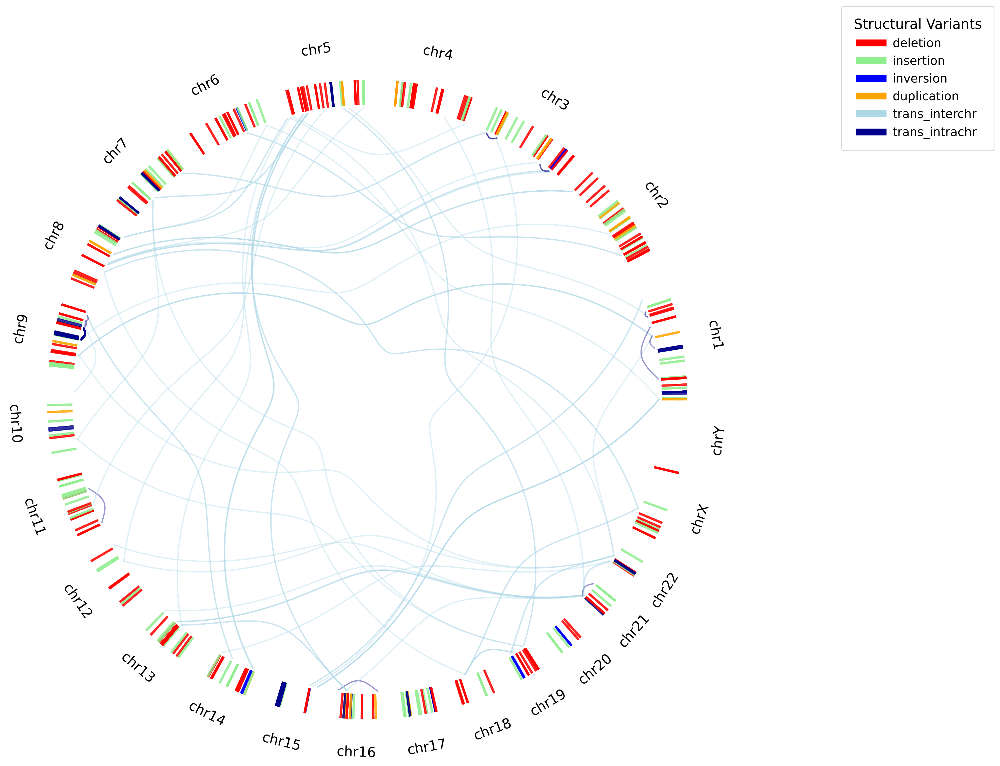

# IdeOGM
*An open-source Python tool for targeted circular ideogram visualization of structural variants in soft tissue and bone tumors*

<p align="center">
  
</p>

IdeOGM is an open-source Python visualization suite designed for the rapid and customizable generation of high-resolution circular ideograms directly from Bionano Optical Genome Mapping (OGM) SMAP tabular data exports. 

The software bridges the gap between text-heavy genomic variant outputs and intuitive, publication-ready infographics. Built to support dual modalities, it offers a robust command-line interface for automated bioinformatics pipelines alongside a clean graphical user interface (GUI) optimized for cytogeneticists, clinical trial coordinators, and wet-lab researchers.

---

## Features

- Switches between a point-and-click GUI and an advanced command-line utility.
- Recursively processes single `.csv` outputs or entire directories, automatically aggregating multi-sample sets.
- Automatically inspects formatting, identifies missing metadata headers, and isolates/logs unparseable logs or system configuration files without throwing fatal crashes.
- Normalizes complex structural variant calling schemas (`deletion_nbase`, `duplication_split`, `translocation_interchr`, etc.) into cleanly categorized color spaces.
- Adjusts output canvases automatically, mapping radial text and chord curves safely to maintain exact legend proportions across wide datasets.

---

## Installation & Requirements

IdeOGM relies entirely on core Python analytical modules and standard data-science dependencies. 
1. Ensure Python 3.8 or higher is installed on your local operating system     
2. Install the necessary baseline requirements via standard Python package managers:    
```bash
pip install pandas matplotlib numpy
```
### Running in CLI Mode (For Automation)
If you are integrating IdeOGM into a bioinformatics pipeline, use the following terminal commands:
```Bash
python main.py /path/to/data/folder/
```
*Parses all compatible SMAP files and saves a combined combined_sv_ideogram.png in the target folder*

```Bash
python main.py /path/to/data/sample_01.csv
```
*Processes a single sample*

```Bash
python main.py /path/to/data/ -o /path/to/results/figure1.png
```
*Creates custom export location* 

## Additional Instructions
    
### Processing an Isolated Case-Study File        
```Bash
python main.py path/to/sample_patient_data.csv
```
    
### Customizing the Publication File Name    
To stream the finished figure canvas into a separate assets directory or supply specific figure nomenclature, use the -o or --output flag:    
```Bash
python main.py path/to/smap_exports/ -o clinical_trials/output/Figure_1_Sarcoma_Case.png
```
    
## Expected Data Input Format     
IdeOGM is custom-built to interpret Bionano Access workflow sheets and native structural variant framework schemas. It scans rows for standard header prefixes (#h) and parses the following explicit spatial vectors:      
- RefcontigID1 / RefcontigID2 (Chromosome origins)      
- RefStartPos / RefEndPos (Base pair positioning coordinates)  
- Type (Structural variant categorization)    
    
## Visual Mapping Configuration    
Variants are plotted relative to a canonical hg38 reference architecture, applying continuous radial calculation algorithms to represent mutations accurately. Variants within an intra-chromosomal locus are represented as high-contrast structural bands (alpha=0.8), whereas distant segment rearrangements or inter-chromosomal links are projected across an interior spanning chord ribbon grid (alpha=0.4).    
| Structural Variant | Color |
| :---: | :---: |
| Deletion | Red |
| Insertion | Light Green |
| Duplication | Orange |
| INTERchromosomal translocation | Light Blue |
| INTRAchromosomal translocation | Dark Blue |    
      
## License & Academic Reference  
This software architecture is made available under the open-source MIT License. Feel free to use, modify, and distribute it in academic and commercial environments. If this visualization suite proves beneficial to your peer-reviewed publications or research pipelines, please attribute the work by citing the repository codebase or the corresponding communication manuscript.
